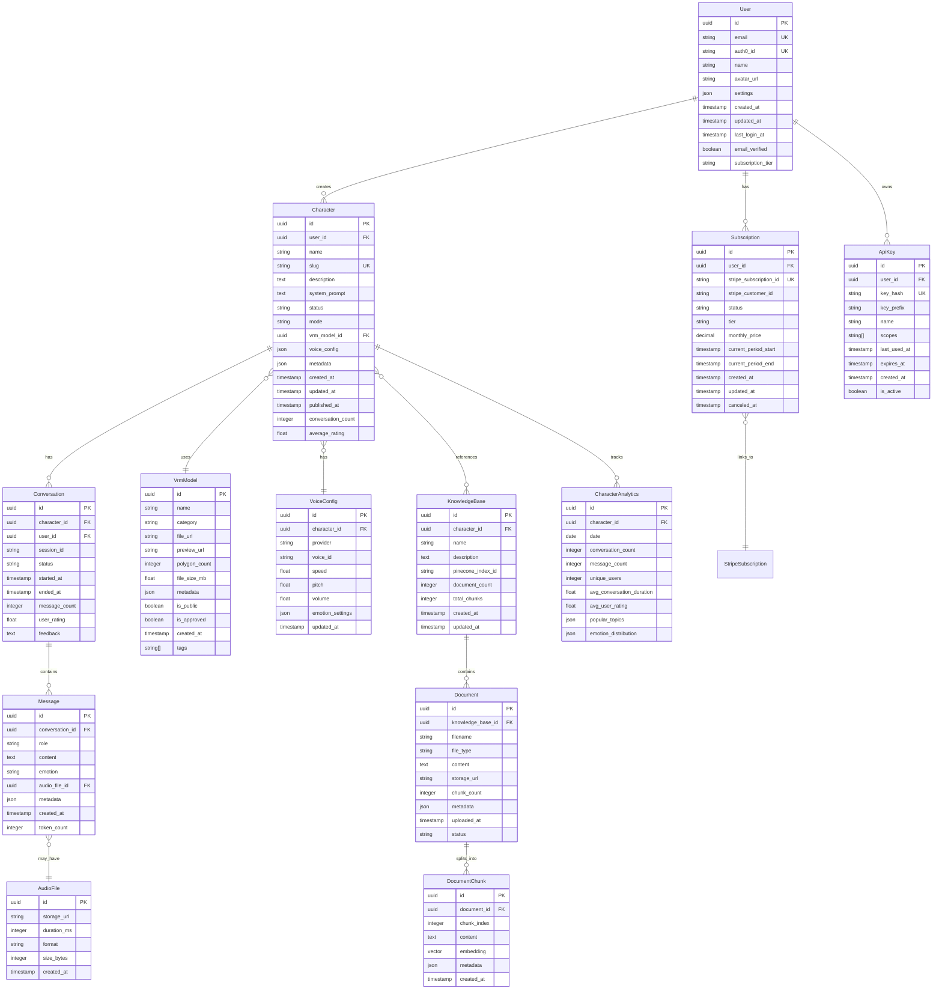

# Data Model Documentation - ChatVRM Platform

## Overview
This document describes the data model for the ChatVRM platform, including entity relationships, key constraints, and design decisions.

## Entity Relationship Diagram



## Core Entities

### User
Central entity representing platform users who create and manage characters.

```sql
CREATE TABLE users (
    id UUID PRIMARY KEY DEFAULT gen_random_uuid(),
    email VARCHAR(255) UNIQUE NOT NULL,
    auth0_id VARCHAR(255) UNIQUE NOT NULL,
    name VARCHAR(255),
    avatar_url TEXT,
    settings JSONB DEFAULT '{}',
    created_at TIMESTAMP DEFAULT CURRENT_TIMESTAMP,
    updated_at TIMESTAMP DEFAULT CURRENT_TIMESTAMP,
    last_login_at TIMESTAMP,
    email_verified BOOLEAN DEFAULT FALSE,
    subscription_tier VARCHAR(50) DEFAULT 'free'
);

CREATE INDEX idx_users_email ON users(email);
CREATE INDEX idx_users_auth0_id ON users(auth0_id);
```

### Character
Represents AI characters created by users.

```sql
CREATE TABLE characters (
    id UUID PRIMARY KEY DEFAULT gen_random_uuid(),
    user_id UUID NOT NULL REFERENCES users(id) ON DELETE CASCADE,
    name VARCHAR(255) NOT NULL,
    slug VARCHAR(255) UNIQUE NOT NULL,
    description TEXT,
    system_prompt TEXT NOT NULL,
    status VARCHAR(50) DEFAULT 'draft',
    mode VARCHAR(50) DEFAULT 'agentic',
    vrm_model_id UUID REFERENCES vrm_models(id),
    voice_config JSONB DEFAULT '{}',
    metadata JSONB DEFAULT '{}',
    created_at TIMESTAMP DEFAULT CURRENT_TIMESTAMP,
    updated_at TIMESTAMP DEFAULT CURRENT_TIMESTAMP,
    published_at TIMESTAMP,
    conversation_count INTEGER DEFAULT 0,
    average_rating FLOAT
);

CREATE INDEX idx_characters_user_id ON characters(user_id);
CREATE INDEX idx_characters_status ON characters(status);
CREATE INDEX idx_characters_slug ON characters(slug);
```

### Conversation
Tracks interaction sessions between users and characters.

```sql
CREATE TABLE conversations (
    id UUID PRIMARY KEY DEFAULT gen_random_uuid(),
    character_id UUID NOT NULL REFERENCES characters(id) ON DELETE CASCADE,
    user_id UUID REFERENCES users(id) ON DELETE SET NULL,
    session_id VARCHAR(255),
    status VARCHAR(50) DEFAULT 'active',
    started_at TIMESTAMP DEFAULT CURRENT_TIMESTAMP,
    ended_at TIMESTAMP,
    message_count INTEGER DEFAULT 0,
    user_rating FLOAT CHECK (user_rating >= 1 AND user_rating <= 5),
    feedback TEXT
);

CREATE INDEX idx_conversations_character_id ON conversations(character_id);
CREATE INDEX idx_conversations_user_id ON conversations(user_id);
CREATE INDEX idx_conversations_started_at ON conversations(started_at);
```

### Message
Stores individual messages within conversations.

```sql
CREATE TABLE messages (
    id UUID PRIMARY KEY DEFAULT gen_random_uuid(),
    conversation_id UUID NOT NULL REFERENCES conversations(id) ON DELETE CASCADE,
    role VARCHAR(50) NOT NULL CHECK (role IN ('user', 'assistant', 'system')),
    content TEXT NOT NULL,
    emotion VARCHAR(50),
    audio_file_id UUID REFERENCES audio_files(id),
    metadata JSONB DEFAULT '{}',
    created_at TIMESTAMP DEFAULT CURRENT_TIMESTAMP,
    token_count INTEGER
);

CREATE INDEX idx_messages_conversation_id ON messages(conversation_id);
CREATE INDEX idx_messages_created_at ON messages(created_at);
```

## Data Design Decisions

### UUID vs Serial IDs
- **Decision**: Use UUIDs for all primary keys
- **Rationale**: 
  - Enables distributed ID generation
  - Prevents ID enumeration attacks
  - Simplifies data migration and merging

### JSONB Fields
- **Usage**: Settings, metadata, voice configurations
- **Benefits**:
  - Flexible schema for evolving features
  - Efficient querying with PostgreSQL
  - Reduces need for schema migrations

### Soft Deletes
- **Implementation**: Use status fields instead of deletion
- **Entities**: Characters, Conversations, Documents
- **Benefits**:
  - Audit trail maintenance
  - Recovery capability
  - Analytics on deleted content

### Denormalized Counters
- **Fields**: conversation_count, message_count, average_rating
- **Update Strategy**: Async background jobs
- **Benefits**:
  - Improved query performance
  - Reduced JOIN operations
  - Acceptable eventual consistency

## Indexing Strategy

### Primary Indexes
```sql
-- High-frequency lookups
CREATE INDEX idx_characters_user_id_status ON characters(user_id, status);
CREATE INDEX idx_conversations_character_id_status ON conversations(character_id, status);
CREATE INDEX idx_messages_conversation_id_created ON messages(conversation_id, created_at);

-- Search optimization
CREATE INDEX idx_characters_name_gin ON characters USING gin(to_tsvector('english', name));
CREATE INDEX idx_documents_content_gin ON documents USING gin(to_tsvector('english', content));

-- Analytics queries
CREATE INDEX idx_analytics_character_date ON character_analytics(character_id, date);
CREATE INDEX idx_messages_created_at_brin ON messages USING brin(created_at);
```

### Composite Indexes
```sql
-- User dashboard queries
CREATE INDEX idx_characters_user_status_updated ON characters(user_id, status, updated_at DESC);

-- Conversation history
CREATE INDEX idx_conversations_user_character_started ON conversations(user_id, character_id, started_at DESC);
```

## Data Integrity Constraints

### Foreign Key Constraints
- All relationships enforced at database level
- CASCADE deletes for dependent data
- SET NULL for optional relationships

### Check Constraints
```sql
-- Rating boundaries
ALTER TABLE conversations ADD CONSTRAINT check_rating 
  CHECK (user_rating IS NULL OR (user_rating >= 1 AND user_rating <= 5));

-- Status enums
ALTER TABLE characters ADD CONSTRAINT check_status 
  CHECK (status IN ('draft', 'published', 'archived'));

-- Positive counts
ALTER TABLE characters ADD CONSTRAINT check_conversation_count 
  CHECK (conversation_count >= 0);
```

### Unique Constraints
```sql
-- Ensure unique slugs
ALTER TABLE characters ADD CONSTRAINT unique_slug UNIQUE (slug);

-- One subscription per user
ALTER TABLE subscriptions ADD CONSTRAINT unique_user_subscription 
  UNIQUE (user_id, status) WHERE status = 'active';
```

## Data Migration Patterns

### Schema Evolution
```sql
-- Adding new fields with defaults
ALTER TABLE characters ADD COLUMN llm_model VARCHAR(50) DEFAULT 'gpt-4';

-- Renaming with zero downtime
ALTER TABLE characters ADD COLUMN character_type VARCHAR(50);
UPDATE characters SET character_type = mode;
-- Deploy code to use character_type
ALTER TABLE characters DROP COLUMN mode;
```

### Data Backfilling
```sql
-- Populate analytics table from historical data
INSERT INTO character_analytics (character_id, date, conversation_count)
SELECT 
  character_id,
  DATE(started_at) as date,
  COUNT(*) as conversation_count
FROM conversations
GROUP BY character_id, DATE(started_at);
```

## Performance Considerations

### Partitioning Strategy
```sql
-- Partition messages by month for better performance
CREATE TABLE messages_2024_01 PARTITION OF messages
  FOR VALUES FROM ('2024-01-01') TO ('2024-02-01');
```

### Archival Strategy
- Move conversations older than 6 months to archive tables
- Compress message content using TOAST
- Store audio files in cold storage after 30 days

### Query Optimization
```sql
-- Materialized view for character stats
CREATE MATERIALIZED VIEW character_stats AS
SELECT 
  c.id,
  c.name,
  COUNT(DISTINCT conv.id) as total_conversations,
  COUNT(DISTINCT conv.user_id) as unique_users,
  AVG(conv.user_rating) as avg_rating
FROM characters c
LEFT JOIN conversations conv ON c.id = conv.character_id
GROUP BY c.id, c.name;

-- Refresh daily
CREATE INDEX idx_character_stats_id ON character_stats(id);
```

## Security Considerations

### Data Encryption
- Encrypt sensitive fields at application level
- Use PostgreSQL pgcrypto for API keys
- TLS for data in transit

### Access Control
```sql
-- Row-level security for multi-tenancy
ALTER TABLE characters ENABLE ROW LEVEL SECURITY;

CREATE POLICY characters_owner_policy ON characters
  FOR ALL
  USING (user_id = current_user_id());
```

### Audit Logging
```sql
CREATE TABLE audit_logs (
  id UUID PRIMARY KEY DEFAULT gen_random_uuid(),
  user_id UUID,
  action VARCHAR(50),
  entity_type VARCHAR(50),
  entity_id UUID,
  changes JSONB,
  ip_address INET,
  user_agent TEXT,
  created_at TIMESTAMP DEFAULT CURRENT_TIMESTAMP
);

CREATE INDEX idx_audit_logs_user_id ON audit_logs(user_id);
CREATE INDEX idx_audit_logs_entity ON audit_logs(entity_type, entity_id);
```