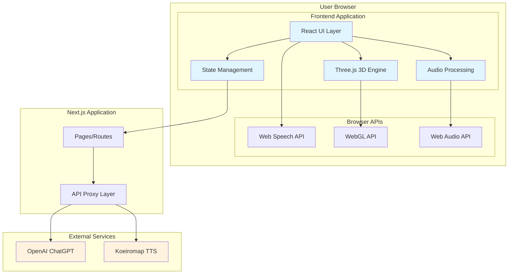
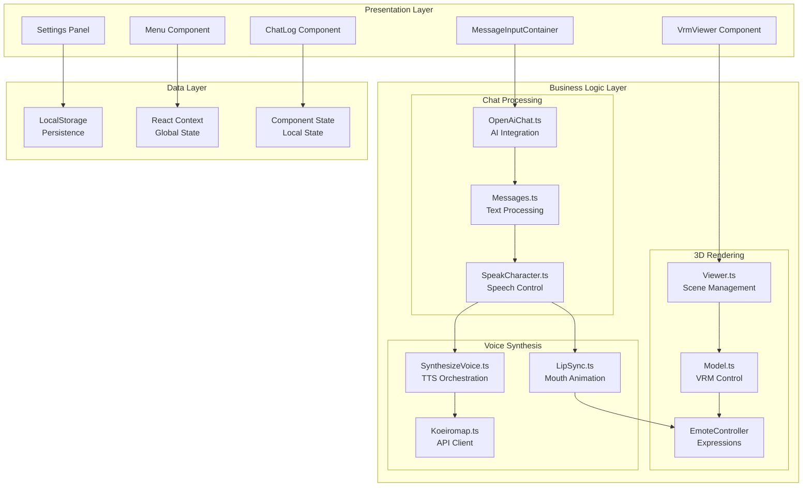
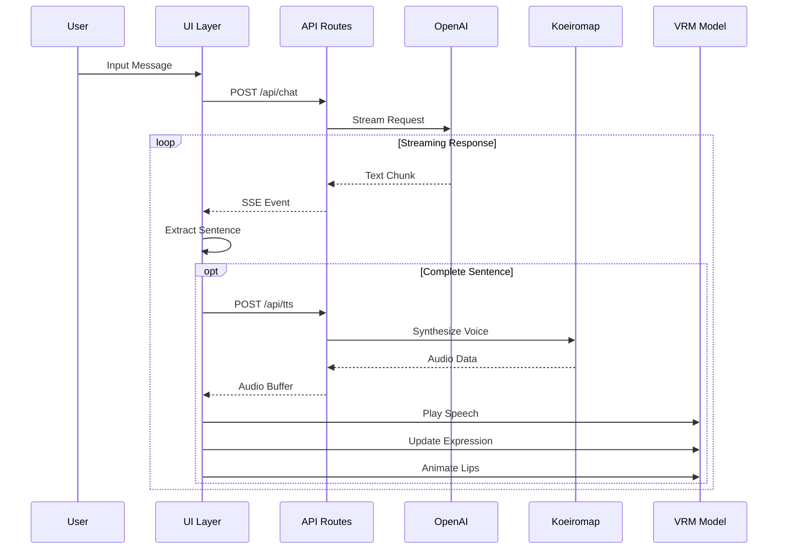
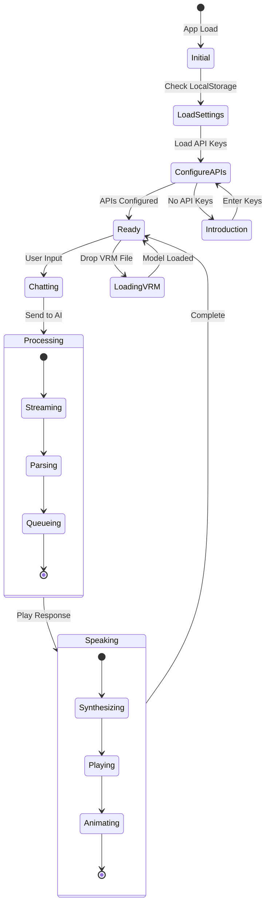
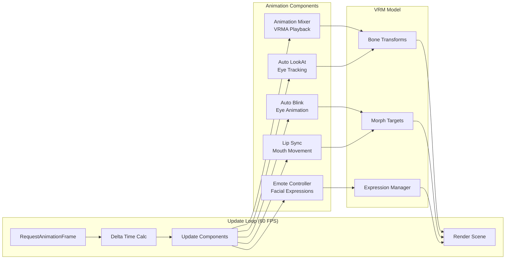
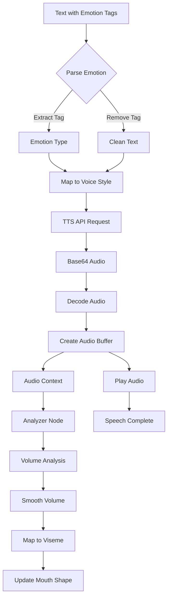
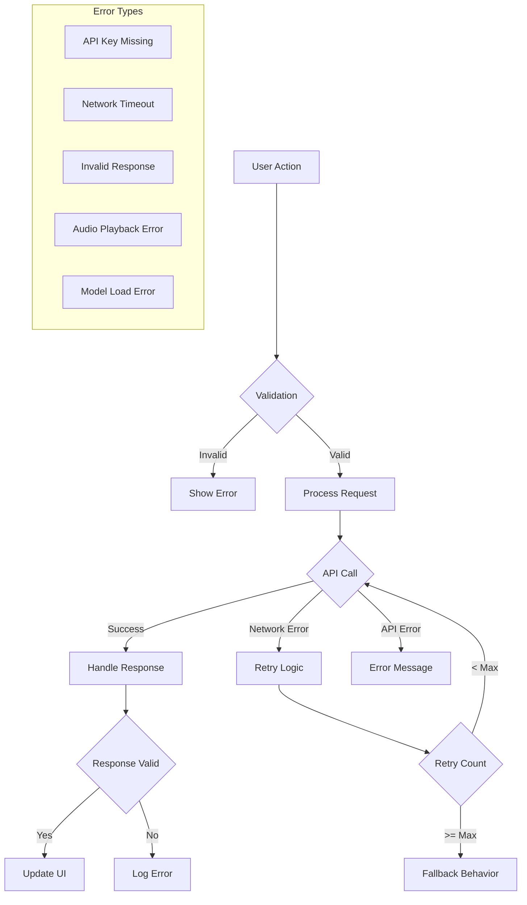
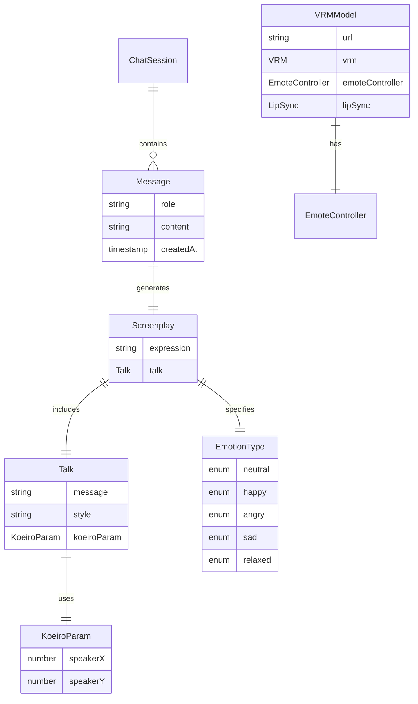
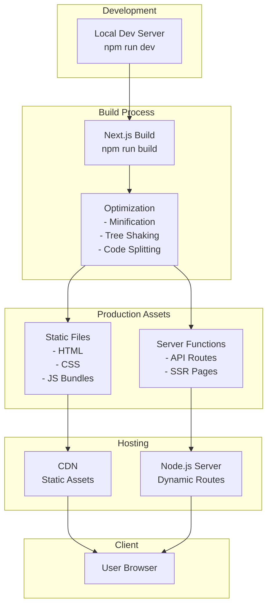
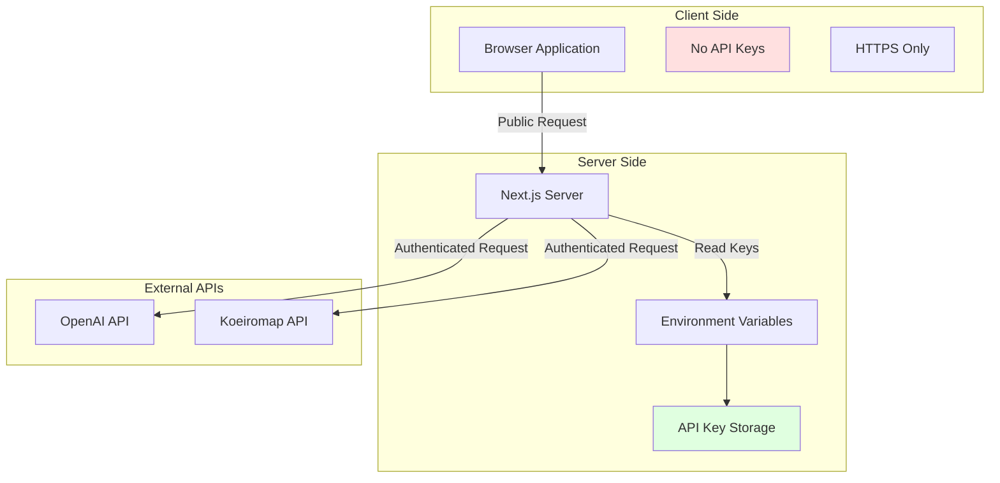

# ChatVRM Architecture Diagrams

This document contains all the architecture diagrams for the ChatVRM platform in Mermaid format. These can be rendered using any Mermaid-compatible viewer or documentation tool.

## 1. System Overview Diagram

## 2. Detailed Component Architecture

## 3. Request Flow Sequence

## 4. State Management Flow

## 5. Animation System Architecture

## 6. Voice Processing Pipeline

## 7. Error Handling Architecture

## 8. Data Model Relationships

## 9. Deployment Architecture

## 10. Security Architecture

## Usage Instructions

These diagrams can be rendered using:
1. GitHub's built-in Mermaid support
2. Mermaid Live Editor (mermaid.live)
3. VS Code with Mermaid extensions
4. Any Markdown viewer with Mermaid support

To view the diagrams:
1. Copy the Mermaid code block
2. Paste into a Mermaid-compatible viewer
3. The diagram will render automatically