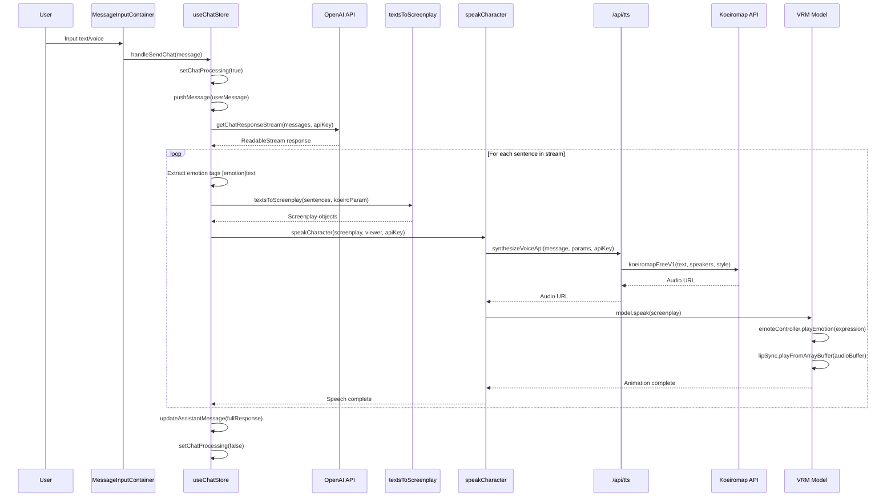
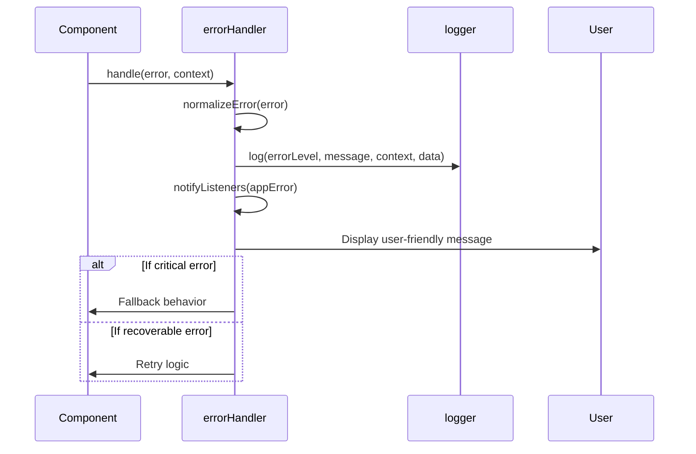
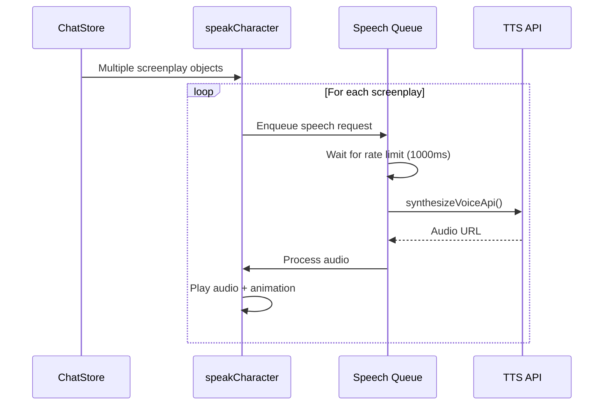

# Audio Synthesis Flow Documentation

## Overview

The ChatVRM audio synthesis pipeline transforms user input into character speech animation through a sophisticated multi-stage process. This document provides comprehensive documentation of the complete flow with sequence diagrams, API integrations, and troubleshooting guides.

## Complete Audio Synthesis Flow

### High-Level Architecture

```
┌─────────────────┐    ┌─────────────────┐    ┌─────────────────┐
│   User Input    │───▶│  Chat Processing │───▶│ Audio Synthesis │
│ (Text/Voice)    │    │   & Streaming    │    │   & Animation   │
└─────────────────┘    └─────────────────┘    └─────────────────┘
```

### Detailed Process Flow

#### 1. User Input Processing
- **Entry Points**: Text input or voice recognition
- **Components**: `MessageInputContainer`, Web Speech API
- **Output**: Validated user message string

#### 2. Chat Store Processing
- **Component**: `useChatStore`
- **Actions**: Message validation, state updates, streaming initiation
- **Error Handling**: API key validation, rate limiting

#### 3. OpenAI Streaming Response
- **API**: OpenAI ChatGPT streaming endpoint
- **Processing**: Real-time sentence extraction with emotion tags
- **Format**: `[emotion]text` patterns parsed via regex

#### 4. Screenplay Conversion
- **Function**: `textsToScreenplay()`
- **Input**: Text arrays with emotion tags
- **Output**: Structured screenplay objects with voice parameters

#### 5. Audio Synthesis
- **Service**: Koeiromap API via `/api/tts`
- **Rate Limiting**: 1 request per second
- **Processing**: Text-to-speech with emotion-based voice styling

#### 6. Character Animation
- **Components**: VRM model, lip sync, emotion controller
- **Actions**: Facial expressions, mouth movements, audio playback

## Sequence Diagrams

### Complete Chat → Audio → Animation Flow



### Error Handling Flow



### Rate Limiting & Queue Management



## API Integration Details

### OpenAI ChatGPT Streaming

**Endpoint**: `https://api.openai.com/v1/chat/completions`

**Request Format**:
```json
{
  "model": "gpt-3.5-turbo",
  "messages": [
    {"role": "system", "content": "system prompt"},
    {"role": "user", "content": "user message"}
  ],
  "stream": true,
  "max_tokens": 200
}
```

**Response Processing**:
```javascript
// Stream parsing in getChatResponseStream()
const chunks = data
  .split("data:")
  .filter((val) => !!val && val.trim() !== "[DONE]");

for (const chunk of chunks) {
  const json = JSON.parse(chunk);
  const messagePiece = json.choices[0].delta.content;
  if (messagePiece) {
    controller.enqueue(messagePiece);
  }
}
```

### Koeiromap TTS Integration

**Endpoint**: `https://api.rinna.co.jp/koeiromap/v1.0/infer`

**Request Format**:
```json
{
  "text": "Hello world!",
  "speaker_x": 0.5,
  "speaker_y": 0.5,
  "style": "happy"
}
```

**Response**: Audio file URL

**Rate Limiting**: 1 request per second enforced by application

### Emotion Tag Processing

**Supported Emotions**:
- `[happy]` → Upbeat, cheerful voice style
- `[sad]` → Melancholic, slower voice style  
- `[angry]` → Intense, forceful voice style
- `[neutral]` → Default, balanced voice style
- `[relaxed]` → Calm, soothing voice style

**Regex Pattern**: `/\[(\w+)\]/g`

**Processing Logic**:
```javascript
const extractEmotionAndText = (text) => {
  const match = text.match(/\[(\w+)\]/);
  const emotion = match ? match[1] : 'neutral';
  const cleanText = text.replace(/\[(\w+)\]/g, '');
  return { emotion, text: cleanText };
};
```

## Performance Characteristics

### Measured Performance Metrics

Based on performance tests:
- **Menu component mount**: ~4ms
- **Menu re-render**: ~0.32ms average
- **MessageInputContainer**: ~0.07ms average
- **Speech synthesis rate**: 1 request/second (configurable)
- **Streaming response**: Real-time processing

### Optimization Strategies

1. **Rate Limiting**: Prevents API overload
2. **Sentence-based Processing**: Reduces perceived latency
3. **Streaming Responses**: Immediate UI feedback
4. **Selective Re-renders**: Zustand selectors minimize updates
5. **Audio Buffer Management**: Efficient memory usage

## Configuration Options

### Environment Variables

```bash
# API Configuration
OPEN_AI_KEY=your_openai_key
KOEIROMAP_API_KEY=your_koeiromap_key
NEXT_PUBLIC_OPENAI_API_URL=https://api.openai.com/v1/chat/completions
NEXT_PUBLIC_KOEIROMAP_API_URL=https://api.rinna.co.jp/koeiromap/v1.0/infer

# Rate Limiting
NEXT_PUBLIC_SPEECH_SYNTHESIS_RATE_LIMIT_MS=1000

# Voice Parameters
NEXT_PUBLIC_KOEIROMAP_SPEAKER_X=0.5
NEXT_PUBLIC_KOEIROMAP_SPEAKER_Y=0.5

# Audio Configuration
NEXT_PUBLIC_LIPSYNC_TIME_DOMAIN_DATA_LENGTH=2048
```

### Runtime Configuration

```javascript
// Voice parameter adjustment
const koeiroParam = {
  speakerX: 0.5, // Voice pitch (0.0 - 1.0)
  speakerY: 0.5, // Voice speed (0.0 - 1.0)
};

// System prompt customization
const systemPrompt = `You are a helpful assistant. 
Use emotion tags like [happy], [sad], [angry] in your responses.`;
```

## Error Handling & Troubleshooting

### Common Error Scenarios

#### 1. API Key Issues
**Error**: `Invalid API Key`
**Cause**: Missing or incorrect OpenAI/Koeiromap API key
**Solution**: Verify API keys in settings or environment variables

#### 2. Rate Limiting Errors
**Error**: `Rate limit exceeded`
**Cause**: Too many requests to OpenAI API
**Solution**: Implement exponential backoff, check API quota

#### 3. Audio Synthesis Failures
**Error**: `Audio processing failed`
**Cause**: Koeiromap API timeout or invalid parameters
**Solution**: Retry with fallback parameters, check network connectivity

#### 4. VRM Animation Errors
**Error**: `Animation failed`
**Cause**: VRM model loading issues or invalid emotion
**Solution**: Reload VRM model, use default emotion

### Debugging Steps

1. **Check Console Logs**: Structured logging provides detailed error context
2. **Verify API Keys**: Ensure all required API keys are configured
3. **Test Network**: Check connectivity to OpenAI and Koeiromap APIs
4. **Monitor Rate Limits**: Ensure speech synthesis respects 1-second limit
5. **Validate Input**: Check for malformed messages or emotion tags

### Error Recovery Strategies

```javascript
// Automatic retry with exponential backoff
const retryWithBackoff = async (fn, retries = 3) => {
  for (let i = 0; i < retries; i++) {
    try {
      return await fn();
    } catch (error) {
      if (i === retries - 1) throw error;
      await new Promise(resolve => setTimeout(resolve, 1000 * Math.pow(2, i)));
    }
  }
};

// Graceful degradation
const speakWithFallback = async (screenplay, viewer, apiKey) => {
  try {
    await speakCharacter(screenplay, viewer, apiKey);
  } catch (error) {
    logger.error('Speech synthesis failed, using text-only mode', { error });
    // Continue with text display only
  }
};
```

## Monitoring & Analytics

### Key Metrics to Track

1. **API Response Times**: OpenAI and Koeiromap latency
2. **Error Rates**: Failed synthesis attempts by error type
3. **Usage Patterns**: Peak usage times, popular emotions
4. **Performance**: Component render times, memory usage
5. **User Engagement**: Message frequency, session duration

### Logging Examples

```javascript
// API request logging
logger.logApiRequest('POST', '/api/chat', { component: 'ChatStore' });

// Performance monitoring
logger.timeStart('speech-synthesis');
await speakCharacter(screenplay, viewer, apiKey);
logger.timeEnd('speech-synthesis');

// Error tracking
logger.error('Speech synthesis failed', {
  component: 'SpeakCharacter',
  action: 'synthesizeVoice',
  emotion: screenplay.expression,
  messageLength: screenplay.talk.message.length
}, error);
```

## Testing Strategy

### Integration Test Coverage

1. **Complete Flow Testing**: User input → Audio output
2. **Error Scenarios**: API failures, network issues, invalid input
3. **State Management**: Persistence, restoration, concurrent requests
4. **Performance**: Rate limiting, memory usage, render optimization
5. **Edge Cases**: Empty messages, malformed emotion tags, quota exceeded

### Mock Configuration

```javascript
// Mock streaming response
const mockStreamResponse = new ReadableStream({
  start(controller) {
    controller.enqueue('[happy]Hello world!');
    controller.enqueue('[sad]Goodbye.');
    controller.close();
  }
});

// Mock TTS response
mockSynthesizeVoice.mockResolvedValue('mock-audio-url');
```

## Future Enhancements

### Planned Improvements

1. **Voice Cloning**: Custom voice model support
2. **Multi-language**: Support for multiple languages
3. **Advanced Emotions**: More nuanced emotion recognition
4. **Real-time Processing**: WebSocket-based streaming
5. **Audio Quality**: Higher fidelity synthesis options
6. **Caching**: Audio response caching for repeated phrases
7. **Analytics**: Advanced usage analytics and insights

### Technical Debt

1. **Error Handler Tests**: Complete test coverage for error scenarios
2. **Performance Optimization**: React.memo implementation for heavy components
3. **Memory Management**: Audio buffer cleanup and optimization
4. **Accessibility**: Screen reader support for audio content
5. **Mobile Optimization**: Touch-friendly voice controls

This comprehensive documentation provides a complete reference for understanding, maintaining, and extending the ChatVRM audio synthesis system.