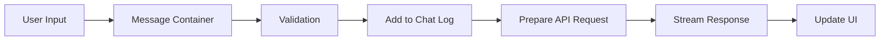
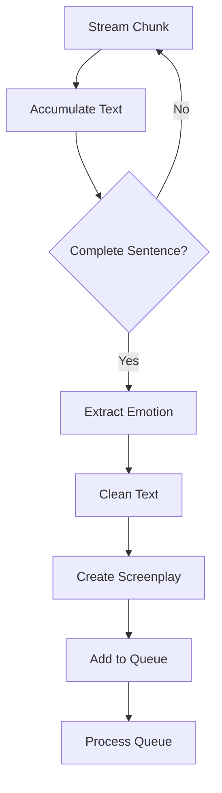
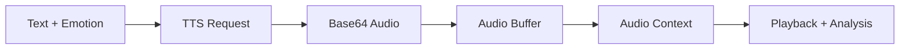
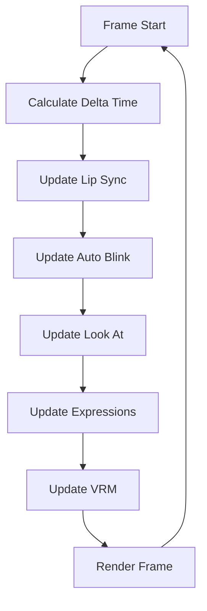

# Data Flow Patterns in ChatVRM

## Overview

This document describes the data flow patterns used throughout the ChatVRM application. Understanding these patterns is crucial for maintaining and extending the application.

## Core Data Flow Patterns

### 1. Streaming Data Pattern

The application uses streaming for real-time AI responses to improve perceived performance and user experience.

#### Pattern Structure
```typescript
// Streaming Response Handler
async function* processStream(stream: ReadableStream) {
    const reader = stream.getReader();
    const decoder = new TextDecoder();
    
    while (true) {
        const { done, value } = await reader.read();
        if (done) break;
        
        const chunk = decoder.decode(value);
        yield chunk;
    }
}
```

#### Implementation in ChatVRM
```typescript
// From handleSendChat in index.tsx
const stream = await getChatResponseStream(messages, openAiKey);
const reader = stream.getReader();

while (true) {
    const { done, value } = await reader.read();
    if (done) break;
    
    const chunk = new TextDecoder("utf-8").decode(value);
    // Process chunk for complete sentences
    if (sentenceEnd.test(receivedMessage)) {
        // Trigger voice synthesis
    }
}
```

#### Benefits
- Lower latency to first response
- Progressive UI updates
- Better resource utilization
- Natural conversation flow

### 2. Queue-Based Processing Pattern

Voice synthesis requests are queued to respect API rate limits and ensure sequential playback.

#### Pattern Structure
```typescript
class ProcessingQueue {
    private queue: Array<() => Promise<void>> = [];
    private processing = false;
    
    async add(task: () => Promise<void>) {
        this.queue.push(task);
        if (!this.processing) {
            await this.process();
        }
    }
    
    private async process() {
        this.processing = true;
        while (this.queue.length > 0) {
            const task = this.queue.shift();
            await task();
            await delay(1000); // Rate limiting
        }
        this.processing = false;
    }
}
```

#### Implementation Example
```typescript
// Speech queue processing
const speechQueue: Screenplay[] = [];

async function processSpeechQueue() {
    if (speechQueue.length === 0) return;
    
    const screenplay = speechQueue.shift();
    await speakCharacter(
        screenplay,
        viewer,
        koeiromapKey,
        onStart,
        onEnd
    );
    
    // Continue processing queue
    processSpeechQueue();
}
```

### 3. Event-Driven Update Pattern

The 3D animation system uses an event-driven pattern with a central update loop.

#### Pattern Structure
```typescript
class AnimationSystem {
    private components: Updatable[] = [];
    private clock = new THREE.Clock();
    
    update() {
        const delta = this.clock.getDelta();
        
        for (const component of this.components) {
            component.update(delta);
        }
        
        requestAnimationFrame(() => this.update());
    }
}
```

#### Implementation in VRM Viewer
```typescript
// From viewer.ts
public update = () => {
    requestAnimationFrame(this.update);
    const delta = this._clock.getDelta();
    
    if (this._model) {
        this._model.update(delta);
    }
    
    this._renderer.render(this._scene, this._camera);
};
```

### 4. State Synchronization Pattern

Multiple components need to stay synchronized with the conversation state.

#### Pattern Structure
```typescript
// Centralized state with effects
const [state, setState] = useState(initialState);

useEffect(() => {
    // Sync with localStorage
    localStorage.setItem(key, JSON.stringify(state));
}, [state]);

useEffect(() => {
    // Sync with dependent components
    updateDependentComponent(state);
}, [state.specificField]);
```

#### Implementation Example
```typescript
// Chat log synchronization
useEffect(() => {
    const params = {
        systemPrompt,
        koeiroParam,
        chatLog
    };
    localStorage.setItem("chatVRMParams", JSON.stringify(params));
}, [systemPrompt, koeiroParam, chatLog]);
```

## Specific Data Flow Scenarios

### 1. User Message Flow



**Data Transformations:**
1. **Input**: Raw text or voice transcript
2. **Validation**: Check for API keys, non-empty message
3. **Chat Log Entry**: `{ role: "user", content: string }`
4. **API Request**: Include system prompt + message history
5. **Response Stream**: Server-sent events with chunks
6. **UI Update**: Progressive text display

### 2. AI Response Processing Flow



**Data Structure Evolution:**
```typescript
// 1. Raw stream chunk
"[{happy}]Hello! How"

// 2. Accumulated text
"[{happy}]Hello! How are you today?"

// 3. Parsed screenplay
{
    expression: "happy",
    talk: {
        message: "Hello! How are you today?",
        style: "happy",
        koeiroParam: { speakerX: 0, speakerY: 0 }
    }
}
```

### 3. Voice Synthesis Data Flow



**Data Transformations:**
```typescript
// 1. Input
{ message: "Hello!", style: "happy", koeiroParam: {...} }

// 2. API Request
{
    text: "Hello!",
    speaker_x: 0,
    speaker_y: 0,
    style: "happy"
}

// 3. API Response
{ audio: "base64_encoded_audio_data" }

// 4. Audio Buffer
ArrayBuffer containing PCM audio data

// 5. Playback
AudioBufferSourceNode connected to destination
```

### 4. Animation Update Flow



**Data Flow per Frame:**
```typescript
// Delta time calculation
const deltaTime = clock.getDelta(); // ~0.016s at 60fps

// Lip sync update
const volume = lipSync.update();
vrm.expressionManager.setValue("aa", volume * 0.5);

// Blink update
blinkController.update(deltaTime);
vrm.expressionManager.setValue("blink", blinkValue);

// Look at update
lookAtController.update(deltaTime);
vrm.lookAt.target = lookAtTarget;

// VRM update
vrm.update(deltaTime);
```

## Data Persistence Patterns

### 1. Local Storage Pattern

Used for persisting user settings and chat history.

```typescript
// Save pattern
const saveToLocalStorage = (key: string, data: any) => {
    try {
        localStorage.setItem(key, JSON.stringify(data));
    } catch (e) {
        console.error("Failed to save to localStorage:", e);
    }
};

// Load pattern
const loadFromLocalStorage = <T>(key: string, defaultValue: T): T => {
    try {
        const item = localStorage.getItem(key);
        return item ? JSON.parse(item) : defaultValue;
    } catch (e) {
        console.error("Failed to load from localStorage:", e);
        return defaultValue;
    }
};
```

### 2. Context Pattern

Used for sharing viewer instance across components.

```typescript
// Context definition
const ViewerContext = createContext<{
    viewer: Viewer;
}>({
    viewer: new Viewer(),
});

// Provider pattern
<ViewerContext.Provider value={{ viewer }}>
    {children}
</ViewerContext.Provider>

// Consumer pattern
const { viewer } = useContext(ViewerContext);
```

## Error Handling Patterns

### 1. Graceful Degradation

```typescript
// API failure handling
try {
    const response = await synthesizeVoice(talk, apiKey);
    await playAudio(response);
} catch (error) {
    console.error("Voice synthesis failed:", error);
    // Continue without audio
    showTextOnly(talk.message);
}
```

### 2. Retry Pattern

```typescript
async function retryableRequest<T>(
    fn: () => Promise<T>,
    maxRetries = 3,
    delay = 1000
): Promise<T> {
    for (let i = 0; i < maxRetries; i++) {
        try {
            return await fn();
        } catch (error) {
            if (i === maxRetries - 1) throw error;
            await new Promise(r => setTimeout(r, delay * (i + 1)));
        }
    }
    throw new Error("Max retries reached");
}
```

## Performance Optimization Patterns

### 1. Debouncing Pattern

Used for user input and updates.

```typescript
const debounce = (fn: Function, delay: number) => {
    let timeoutId: NodeJS.Timeout;
    return (...args: any[]) => {
        clearTimeout(timeoutId);
        timeoutId = setTimeout(() => fn(...args), delay);
    };
};

// Usage
const debouncedSave = debounce(saveSettings, 500);
```

### 2. Memoization Pattern

Used for expensive computations.

```typescript
const memoize = <T extends (...args: any[]) => any>(fn: T): T => {
    const cache = new Map();
    return ((...args: Parameters<T>) => {
        const key = JSON.stringify(args);
        if (cache.has(key)) {
            return cache.get(key);
        }
        const result = fn(...args);
        cache.set(key, result);
        return result;
    }) as T;
};
```

## Best Practices

### 1. Data Immutability
Always create new objects/arrays when updating state:
```typescript
// Good
setChatLog(prev => [...prev, newMessage]);

// Bad
chatLog.push(newMessage);
setChatLog(chatLog);
```

### 2. Type Safety
Use TypeScript interfaces for all data structures:
```typescript
interface Message {
    role: "user" | "assistant" | "system";
    content: string;
}

interface Screenplay {
    expression: EmotionType;
    talk: Talk;
}
```

### 3. Error Boundaries
Wrap critical components with error boundaries:
```typescript
<ErrorBoundary fallback={<ErrorMessage />}>
    <VrmViewer />
</ErrorBoundary>
```

### 4. Resource Cleanup
Always clean up resources:
```typescript
useEffect(() => {
    const controller = new AbortController();
    
    fetchData(controller.signal);
    
    return () => {
        controller.abort();
    };
}, []);
```

## Monitoring Data Flow

### Debug Points
1. **Network Tab**: Monitor API requests/responses
2. **Console Logging**: Strategic logging at transformation points
3. **React DevTools**: Inspect component state and props
4. **Performance Tab**: Profile rendering and updates

### Key Metrics
- Message to first speech latency
- Frame rate during animations
- Memory usage over time
- API response times