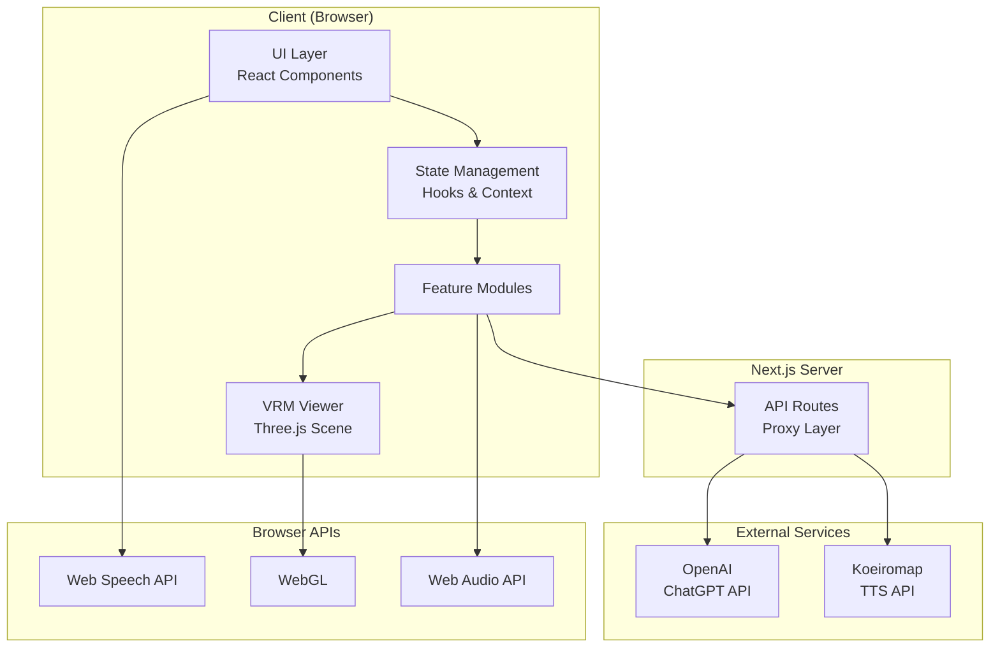
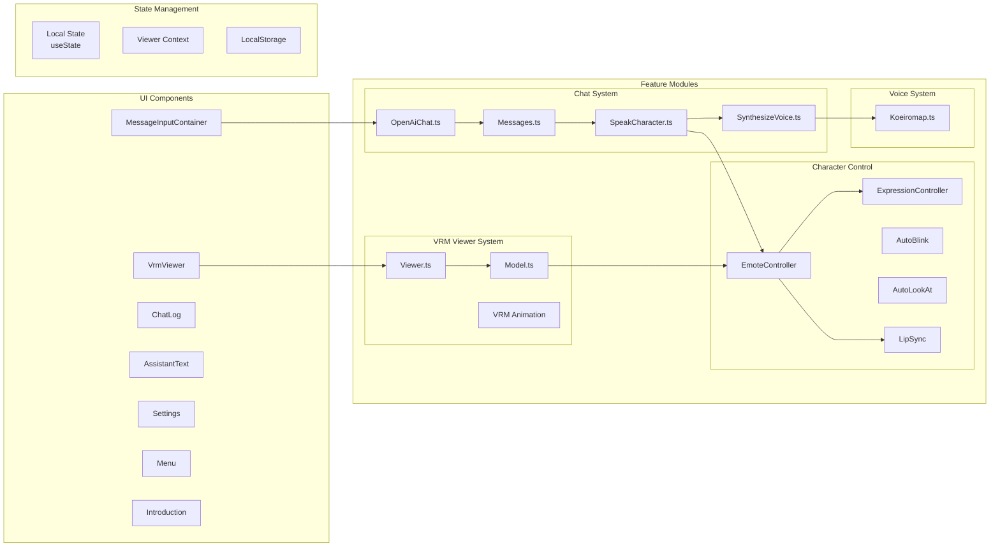
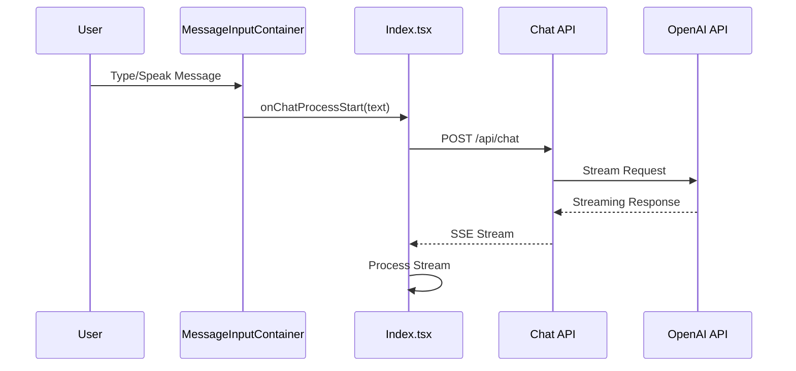
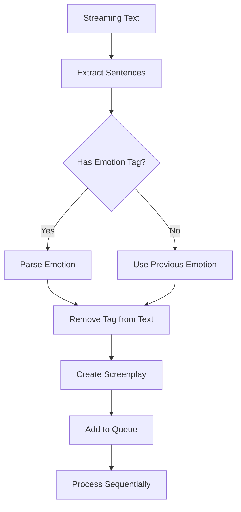
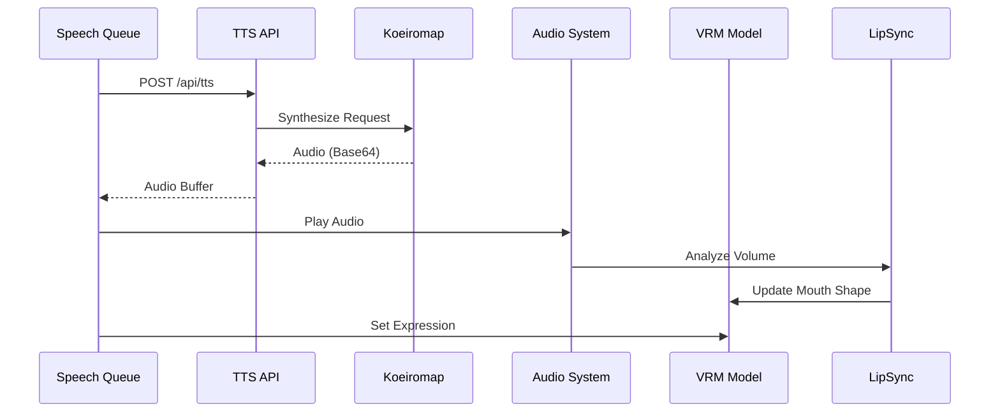
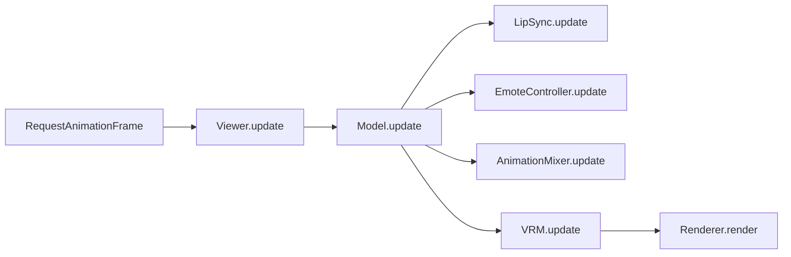
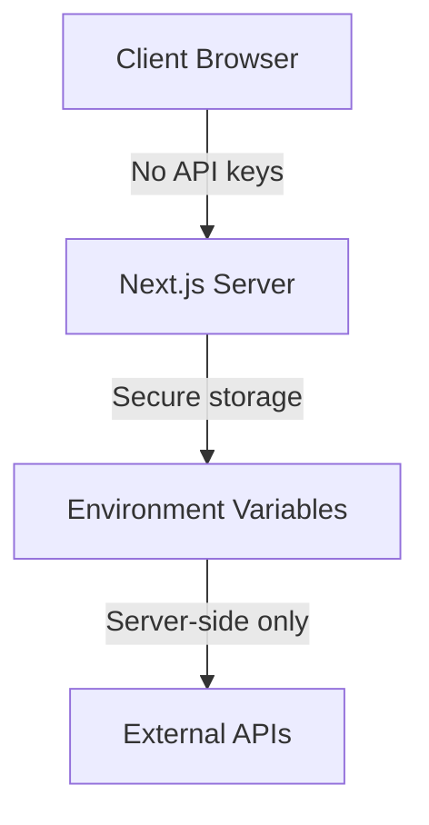
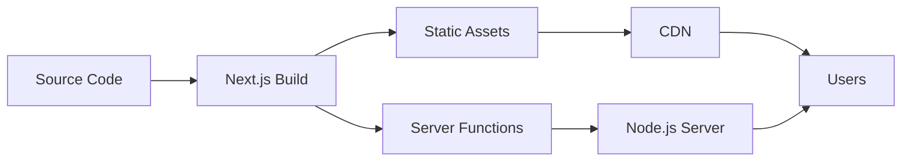

# ChatVRM System Architecture

## Overview

ChatVRM is a browser-based 3D character conversation application that combines VRM 3D models with conversational AI, voice recognition, and text-to-speech synthesis. This document provides a comprehensive view of the system architecture, component relationships, and data flow patterns.

## High-Level Architecture



## Detailed Component Architecture



## Data Flow Architecture

### 1. User Input Flow



### 2. Message Processing Flow



### 3. Voice Synthesis & Animation Flow



## Component Relationships

### Core System Modules

| Module | Responsibility | Dependencies |
|--------|---------------|--------------|
| **Viewer** | Three.js scene management | Three.js, @pixiv/three-vrm |
| **Model** | VRM model control | Viewer, EmoteController, LipSync |
| **EmoteController** | Expression & behavior management | ExpressionController, AutoBlink, AutoLookAt |
| **Chat System** | AI conversation handling | OpenAI API, Message processor |
| **Voice System** | Text-to-speech synthesis | Koeiromap API, Audio Context |
| **LipSync** | Audio-to-mouth animation | Web Audio API |

### API Layer Architecture

```mermaid
graph TD
    subgraph "Client"
        A[React App]
    end
    
    subgraph "Next.js API Routes"
        B[/api/chat]
        C[/api/tts]
    end
    
    subgraph "External Services"
        D[OpenAI API]
        E[Koeiromap API]
    end
    
    A -->|CORS-safe request| B
    A -->|CORS-safe request| C
    B -->|Server-side request<br/>with API key| D
    C -->|Server-side request<br/>with API key| E
```

## State Management Patterns

### 1. Component State (Local)
```typescript
// In React components
const [chatLog, setChatLog] = useState<Message[]>([]);
const [chatProcessing, setChatProcessing] = useState(false);
const [assistantMessage, setAssistantMessage] = useState("");
```

### 2. Context State (Global)
```typescript
// ViewerContext for 3D viewer instance
const ViewerContext = createContext<{ viewer: Viewer }>();
```

### 3. Persistent State
```typescript
// LocalStorage for settings and history
localStorage.setItem("chatVRMParams", JSON.stringify({
    systemPrompt,
    koeiroParam,
    chatLog
}));
```

## Key Architectural Patterns

### 1. Streaming Architecture
- **Pattern**: Server-Sent Events (SSE) for real-time AI responses
- **Benefits**: Lower latency, progressive UI updates, better perceived performance
- **Implementation**: ReadableStream with chunk processing

### 2. Queue-Based Processing
- **Pattern**: Sequential queue for voice synthesis
- **Benefits**: Rate limiting (1 req/sec), ordered playback, resource management
- **Implementation**: Promise-based queue with async/await

### 3. Component Composition
- **Pattern**: React component composition with hooks
- **Benefits**: Reusable UI components, clear separation of concerns
- **Implementation**: Functional components with custom hooks

### 4. Proxy Pattern
- **Pattern**: API routes as proxies to external services
- **Benefits**: Secure API key management, CORS handling
- **Implementation**: Next.js API routes

### 5. Observer Pattern
- **Pattern**: Event-driven updates for animations
- **Benefits**: Decoupled animation control, smooth transitions
- **Implementation**: Animation mixer with update loops

## Performance Architecture

### Rendering Pipeline


### Optimization Strategies

1. **Streaming Processing**
   - Process sentences as they arrive
   - Begin voice synthesis before full response
   - Progressive UI updates

2. **Resource Management**
   - Frustum culling disabled for VRM models
   - Texture and geometry cleanup on model change
   - Audio context reuse

3. **Caching**
   - LocalStorage for user preferences
   - In-memory emotion state
   - Audio buffer reuse

## Security Architecture

### API Key Management


### Data Flow Security
1. **Client-Server**: HTTPS encryption
2. **API Keys**: Server-side only, never exposed to client
3. **User Data**: Minimal storage, no sensitive data persistence
4. **CORS**: Handled by Next.js API proxy layer

## Deployment Architecture

### Build & Deployment


### Environment Configuration
- **Development**: Local development server with hot reload
- **Production**: Optimized build with minification
- **Environment Variables**: Separate configs for dev/prod

## Extension Points

### 1. Adding New Emotions
- Extend `EmotionType` enum
- Add expression mappings
- Update system prompt
- Map to voice styles

### 2. Custom VRM Models
- Drag-and-drop support
- Automatic bone mapping
- Expression validation
- Animation compatibility

### 3. Alternative AI Providers
- Implement streaming interface
- Maintain message format
- Handle provider-specific features

### 4. Additional Voice Providers
- Implement TTS interface
- Handle audio format conversion
- Support emotion mapping

## Monitoring & Debugging

### Debug Points
1. **Network**: API route requests and responses
2. **Rendering**: Three.js inspector, WebGL stats
3. **State**: React DevTools, console logging
4. **Audio**: Web Audio API analyzer

### Performance Metrics
- Frame rate (target: 60 FPS)
- API response time
- Voice synthesis latency
- Memory usage

## Future Architecture Considerations

### Scalability
- WebRTC for peer-to-peer features
- WebSocket for real-time collaboration
- Service worker for offline support

### Extensibility
- Plugin system for custom behaviors
- Modular animation system
- Configurable AI personalities

### Platform Support
- Mobile optimization
- VR/AR integration
- Multi-language support